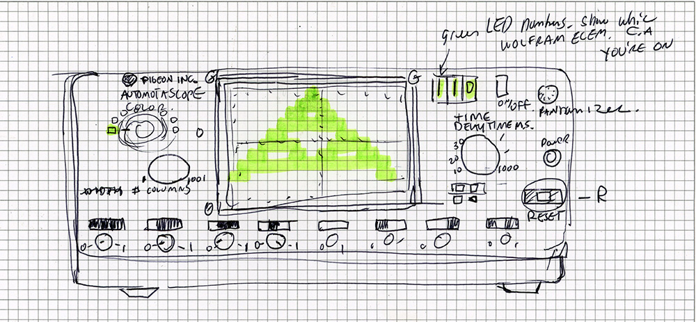

# Automatascope

## Project to make a user interface for selecting the 255 possible basic cellular automata, pictured as an oscilloscope. 

### Stretch goal: Build this as a real thing using a raspberry pi, an lcd breakoutboard and a whole lot of buttons and knobs. Isn't it weird how "knob" has a "k."

Tech:
- Go -> Language
- Ebitengine -> Game engine for Go

